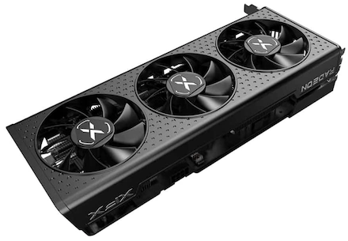

# XFX RX 6600 XT on macOS: disable Zero RPM with SoftPowerPlayTable

<table>
 <tr><td><b>XFX Speedster QICK 308 AMD Radeon RX 6600 XT Black 8GB GDDR6</b></td></tr>
 <tr><td align=center>
</table>

<details>
<summary>
<h3>Note about Ventura 13.4(April 2023)</h3>
</summary>

There are users on latest versions of macOS Ventura (currently 13.4) saying that the option to disable Zero RPM feature when using SoftPowerPlayTable (SPPT) string seems to have been lost. Even with it loaded from OpenCore config.plist file, GPU fans are mostly stopped and temperature varies between 50 and 55º (approximately 10º more than in Windows), the same as without SPPT.
It's something I've verified myself.

There is a way to recover the lost function. When modifying the vBIOS file in Windows with MorePowerTool, instead of deactivating Zero RPM (checkbox unchecked)) it remains enabled (checkbox checked) but the temperatures at which the fans start and stop are modified. By default they are configured like this: Stop Temperature 50º and Start Temperature 60º. I have tried setting Start Temperature to 45º and Stop temperature to 40º, created the new registry key (Save as REG or Write SPPT) and exported it to OpenCore config.plist file. With this modification, in macOS fans spin and stop with the GPU temperature around 40º, achieving a result similar to what was lost. Performance in GeekBench 6 is as expected, 98.000 – 114.000 with an RX 6600 XT model.


</details>

### Preface

Although graphics cards assembled by XFX have negative comments in Hackintosh forums by having custom BIOS that can be more problematic for macOS that other brands, I have installed a XFX QICK 308 AMD Radeon RX 6600 XT 8GB in Monterey 12.2.1 and the result has been excellent, installation was very simple and performance is much higher than that of the previous card, RX 580 8GB.

This card is one of the 6600 XT cheapest even though it can still be considered expensive compared to what would be logical in other circumstances (shortage of components and mined cryptocurrencies).

Main components of my computer are Z390 Aorus Elite board and Intel i9-9900K CPU.

Current macOS status of AMD 6000 series graphics cards is:

<table>
	<tr><td>Working on macOS</td></tr>
	<tr><td>Family Navi 21</td><td>6800, 6800 XT and 6900 XT (since Big Sur 11.4)</td></tr>
	<tr><td>Family Navi 23</td><td>6600 and 6600 XT (since Monterey 12.1)</td></tr>
	<tr><td>NOT working on macOS</td></tr>
	<tr><td>Family Navi 22</td><td>6700 XT</td></tr>
	<tr><td>Family Navi 24</td><td>6400, 6500 and 6500 XT</td></tr>
</table>

Of course 6800 and 6900 series are clearly more powerful than the 6600 but their current market price is very high. 6600 XT has higher performance than 6600.

The card is long size but no longer than the XFX RX 580 it will replace. Surprisingly, it's even slightly lighter, probably because of the metal housing that the RX 580 incorporates. Requires 8 pin power connector and recommended power supply at least 600-650W. It has 4 DisplayPort ports and 1 HDMI port.

### Installation

Physical placement of the card does not deserve comment, it's like any other PCI-e slot card.

Installation on macOS is very simple. The same EFI with OpenCore 0.7.8 (Lilu and WhateverGreen included) that worked with the RX 580 works for the 6600 XT with a single change: add `agdpmod=pikera` in boot-args to prevent the screen from going black on the desktop.

The card is well recognized in System profile.

### Working on macOS

Overall performance is very good, smooth, with 2560x1440 resolution at 60Hz on a 4K monitor. Score in GeekBench 5 test is around 60% higher than the RX 580 (around **80000** vs **50000**).

### Working on Windows

Many Hackintosh users have double booting with Windows. Here the impressions are also very good, system has kept the same AMD drivers without requiring update.

Score in the Geeks3D FurMark test is double with the RX 6600 XT than with the RX 580 (approx. **6100** vs **3000**).

### Temperature sensor

Starting with the Radeon VII model, it is necessary to use kexts to read the temperature of AMD graphics cards since macOS stopped exposing that data directly. This also applies to the 6000 series. To know the temperature of the card you can use [RadeonSensor](https://github.com/ChefKissInc/RadeonSensor). It consists of 3 elements:

- Radeon sensor.kext: Lilu plugin to read card temperature
- SMCRadeonGPU.kext: to export data via VirtualSMC to monitoring tools such as iStat Menus
- RadeonGadget.app: to display the temperature in the menu bar, it requires RadeonSensor.kext only.

Note: SMCRadeonGPU.kext has to go after RadeonSensor.kext in the config file.plist of OpenCore and of course both after Lilu and VirtualSMC.

I have tested these 2 extensions together and they seem to work well, iStat Menus adds the temperature of the 6600 XT as one more sensor to display in the menu bar.

### Resizable BAR (ReBAR)

AMD Radeon 6600 cards support ReBAR. To activate this feature you must:

- Enable it in BIOS menu (usually next to Above 4G Decoding option, ReBAR is displayed when enabling this option)
- Set config file.plist in order for OpenCore to boot with ReBAR enabled, you have to set the value of Boot >> Quirks >> ResizeAppleGpuBars=0 (instead of -1, default value).

**Note**: UEFI >> Quirks >> ResizeGpuBars must always be -1.
 
I have tested the card with ReBAR on and off and I have not noticed any difference. GeekBench 5 test scores on macOS and FurMark on Windows have been virtually identical.
It is likely that with a CPU of 10th generation or newer and games of big graphic demand the performance will improve with ReBAR enabled but, at least in my system, there is no gain in it.

## Zero RPM and softPowerPlayTable

By default, fans of the RX 6600 XT card (like other AMD models) are stopped below 60º, it is what is known as Zero RPM. This has as main advantage the absence of noise except when there is a high graphic requirement.

Users who have this card in a Hackintosh with dual boot have observed that temperature, with idle system, is usually 10-15º lower in Windows than in macOS (35-40º vs 50º). In both systems Zero RPM keeps fans stopped below 60º.

On Windows it is easy to enable/disable Zero RPM from the Radeon software that has this option in custom settings. But on macOS there is no such possibility. So far, existing option to disable Zero RPM in macOS is the creation on Windows, from the AMD card ROM, of a SoftPowerPlayTable (sPPT) (contains the graphics card settings in the form of a hexadecimal value) that OpenCore can load into DeviceProperties or in SST. If the sPPT is saved in Windows after disabling Zero RPM, when macOS loads the sPPT also works with Zero RPM disabled. But it is a complex task that requires specific programs and is not within the reach of the inexperienced user.
 
### AMD PowerPlay
 
AMD's PowerPlay technology allows the graphics card to vary its performance according to demand, switching between high performance and maximum energy savings. It has automatic operating modes according to predefined parameters and also allows user settings. Windows 10 and 11 can make a copy of these power profiles in the form of a registry key called SoftPowerPlayTables (sPPT onwards) whose value is a long hexadecimal string. It is a way to have a quick reference by the operating system. This sPPT key can be read and modified by some utilities. Thanks to this, it is possible to modify operation's parameters of the Radeon by changing its behavior and its power management.
 
### Zero RPM
 
AMD Radeon cards of 5000 and 6000 series come from factory with the Zero RPM function activated so that fans are stopped below a temperature (usually 60º), this makes them completely silent except when the graphics processor is required (tests, games, etc.). As for the RX 6600 and 6600 XT models, it has been commented that, in macOS, they usually work at higher base temperature than in Windows, approximately 10-15º. On my PC, for example, the base temperature on Windows is 35-40º and on macOS it is 50-55º. Although these are perfectly valid safe temperatures for daily use, some users would prefer to have lower values.

The fastest and most effective way to achieve this is by deactivating the Zero RPM function so that fans are spinning all the time and not just above a predefined temperature. However, this is very simple to do on Windows with the Radeon software but on macOS there is no such option.

### SoftPowerPlayTable

One way to disable Zero RPM on macOS without changing any other parameters is using sPPT. It is a more complex method than the patch for Monterey 12.3 but it has the advantage that the GPU behavior, including GeekBench 5 scores, do not change.
To obtain the sPPT you have to go on Windows, where the registry key is generated and exported to a file that we take to macOS, here the file is modified and a new property is added to the OpenCore config.plist file.

### Phase 1 on Windows

We need 2 programs:
 
- GPU-Z (from TechPowerUp): Loads the firmware (vBIOS = video BIOS) of the graphics card and exports it to a ROM file that can be read by MorePowerTool.
- MorePowerTool (MPT) (from Igor'sLAB): Reads the ROM file and handles the registry key PP_PhmSoftPowerPlayTable (deleting current or creating new).

GPU-Z loads the specifications and settings of the GPU and exports everything to a file. To export (Graphics Card tab) the arrow icon coming out of the rectangle under the AMD Radeon logo is used. In the Advanced tab you have to note the Bus number in the DeviceLocation key, this number (on my system it is 3) is important later, when searching for the sPPT key in the Windows registry.


	

 
MPT is where the task of generating the sPPT with Zero RPM disabled and writing it to the registry is performed.

- At the top, choose the GPU model, it usually shows at the beginning of the name the bus number that we wrote down earlier (3 in this case).
- It is recommended to delete the table that may have existed before >> Delete SPPT button.
- Load the previously generated rom file from GPU-Z.
- Modify the Zero RPM option by unchecking the checkbox in 2 places: Features tab and Fan tab.
- Write the new table to the registry (Write SPPT button): the registry key is called PP_PhmSoftPowerPlayTable and is located in
`HKEY_LOCAL_MACHINE\SYSTEM\CurrentControlSet\Control\Class\{4d36e968-e325-11ce-bfc1-08002be10318}\`
There are several numbered keys here, choose the one that matches the bus number that you have written down from before: `0003\PP_PhmSoftPowerPlayTable`. With the `0003` key selected, export it as REG file, not as TXT file. File structure is different in each case and I have seen that it is easier to edit REG file. Regedit exports the complete `0003` key. Change the file extension from reg to txt and save it in a place accessible from macOS.


	


**Note**: We don't need to access the Registry to find the PP_PhmSoftPowerPlayTable value. The "Save" button will export the registry file which has only the PhmSoftPowerPlayTable block, in this way it's easier to get the data.

 ### Phase 2 on macOS

***SSDT Method:***

You can read [here](./SSDT/README.md) how to extract PowerPlayTable directly from the ROM file and convert it to hexadecimal data that can be used within an SSDT file instead of writing it to the DeviceProperties key of `config.plist`.

***DeviceProperty Method:***

Fix the text file to be able to use it in OpenCore. I used BBEdit but any app capable of editing plain text can do.

- Remove all keys but `PP_PhmSoftPowerPlayTable`
- Remove string `"PP_PhmSoftPowerPlayTable"=hex:` at the beginning of the text
- Find and replace:
	- remove commas
	- Remove leading spaces of all lines
	- remove backslashes at the end of the lines
	- remove line breaks to get a single-line string, you have to use Grep for this in the Find and Replace dialog.

Text before is like this (not the whole string is displayed):

> "PP_PhmSoftPowerPlayTable"=hex:a6,09,12,00,02,22,03,ae,09,00,00,22,43,00,00,83,&bsol;
>  &nbsp;&nbsp;00,18,00,00,00,1c,00,00,00,00,00,00,76,00,00,00,00,00,00,00,00,00,00,00,00,&bsol;
>  &nbsp;&nbsp;00,01,00,00,00,01,00,00,00,0d,00,00,00,52,0b,00,00,00,05,00,00,e8,03,00,00,&bsol;

After is like this:

> a6091200022203ae090000224300008300180000001c000000000000760000000000000000000000000001000000010000000d000000520b000000050000e8030000

It is necessary to know the PCI device path to the graphics card, it can be done with the `gfxutil` tool (Terminal) or from Hackintool in the PCIe tab. In my case is:
`PciRoot(0x0)/Pci(0x1,0x0)/Pci(0x0,0x0)/Pci(0x0,0x0)/Pci(0x0,0x0)`
Note: Device Name and Device Path may be different on your system.

Open config.plist file, look for \
`DeviceProperties >> Add >> PciRoot(0x0)/Pci(0x1,0x0)/Pci(0x0,0x0)/Pci(0x0,0x0)/Pci(0x0,0x0)`\
and add the PP_PhmSoftPowerPlayTable key, its value as Data is the long text string.
	

 
Restart. If everything went well, you will see that fans are spinning all the time with a very low sound, base temperature rarely exceeds 35º and performance of the GPU and scores in tests have not changed.


---

### AMD 5000 and 6000 performance issue in Monterey 12.3 (fixed in Monterey **12.3.1** and newer)

The release of macOS Monterey 12.3 has broken the operation of Radeon 5000 and 6000 families, not in all cases but in quite a few of them judging by comments posted on the forums. This problem has also happened on real Macs but it seems to be more much more frequent on Hackintosh. 5500, 5700, 6800 and 6900 models (XT and non XT) have been most affected. 6600 models (XT and non XT) seem to be free of the issue that manifests itself in a very evident drop in graphic performance after updating to 12.3, in some cases the system becomes unusable and in other cases a big part of the graphic power is simply lost.
	
My GPU is RX 6600 XT so it has not been affected by this issue.

Solutions have been proposed to fix this. The simplest is to add in DeviceProperties of config.plist some properties that set Henbury framebuffer for each of the 4 ports of this GPU. By default Radeon framebuffer (ATY,Radeon) is loaded. But, in `AMDRadeonX6000Framebuffer.kext >> Contents >> Info.plist`, AMDRadeonNavi23Controller has "ATY,Henbury" and 6600 series are Navi 23. This is why this framebuffer is specifically proposed.
 
The patch is added in this way: 
 
``` xml
<key>DeviceProperties</key>
    <dict>
        <key>Add</key>
        <dict>
            <key>PciRoot(0x0)/Pci(0x1,0x0)/Pci(0x0,0x0)/Pci(0x0,0x0)/Pci(0x0,0x0)</key>
            <dict>
                <key>@0,name</key>
                <string>ATY,Henbury</string>
                <key>@1,name</key>
                <string>ATY,Henbury</string>
                <key>@2,name</key>
                <string>ATY,Henbury</string>
                <key>@3,name</key>
                <string>ATY,Henbury</string>
            </dict>
        </dict>
        <key>Delete</key>
        <dict/>
    </dict>
```

Note: PCI path to the GPU may be the same on your system but it is convenient to check it with Hackintool (app) or `gfxutil` (Terminal utility).

#### Patch and Zero RPM

Although my GPU has not been affected by this Monterey 12.3 issue, I have tried the patch motivated by curiosity to check if the card works differently (better or worse). When booting with the patch, it gets my attention that the GPU temperature is, with idle system, 10-15º below the usual 50º. The cause is in the deactivation of the Zero RPM feature: fans spin all the time with a small drawback that is the noise generated (very low volume, almost imperceptible except in quiet environment).

Graphics performance is good with the patch. GeekBench 5 metal scores are lower but other benchmarks such as Unigine Valley or GFXBench Metal are almost identical. Maximum temperature when forcing the GPU has not changed, about 80º, the same as without the patch. But basic temperature at iddle system ranges from 35 to 40º. Sensations when performing common tasks on macOS are the same (excellent) with or without patch. 

Unexpectedly, I have seen a way to disable Zero RPM in macOS, it is easier to implement than creating sPPT in Windows and its subsequent transfer to macOS.

It's up to you to choose what you prefer.
 
- Without patch: base temperature is around 50º, fans are usually stopped and GeekBench 5 score is higher.
- With patch: base temperature is below 40º, fans are always running although the noise produced is very low but GeekBench 5 score is lower.
	
#### Framebuffers
 
This patch can be applied to the other Radeon models affected by the Monterey 12.3 issue to fix that bad behaviour and not only to disable Zero RPM.
 
Framebuffers available in AMDRadeonX6000Framebuffer.kext >> Contents >> Info.plist.

<table>
	<tr><td><b>5700</b> - Navi 10 - AMDRadeonNavi10Controller</td></tr>
	<tr><td>device-id: 0x73101002 0x73121002 0x73181002 0x73191002 0x731A1002 0x731B1002 0x731F1002 0x73BF1002</td></tr>
	<tr><td>framebuffer: ATY,Adder / ATY,Ikaheka</td></tr>
	<tr><td height="24"></td></tr>
	<tr><td><b>5600</b> - Navi 12 - AMDRadeonNavi12Controller</td></tr>
	<tr><td>device-id: 0x73601002 0x73621002</td></tr>
	<tr><td>framebuffer: ATY,Sunbeam</td></tr>
	<tr><td height="24"></td></tr>
	<tr><td><b>5500</b> - Navi 14 - AMDRadeonNavi14Controller</td></tr>
	<tr><td>device-id: 0x73401002 0x73411002 0x73431002 0x73471002 0x734F1002</td></tr>
	<tr><td>framebuffer: ATY,Python / ATY,Keelback / ATY,Boa</td></tr>
	<tr><td height="24"></td></tr>
	<tr><td><b>6800</b> and <b>6900</b> - Navi 21 - AMDRadeonNavi21Controller</td></tr>
	<tr><td>device-id: 0x73A01002 0x73A21002 0x73A31002 0x73AB1002 0x73AE1002 0x73AF1002 0x73BF1002</td></tr>
	<tr><td>framebuffer: ATY,Belknap / ATY,Carswell / ATY,Deepbay</td></tr>
	<tr><td height="24"></td></tr>
	<tr><td><b>6600</b> - Navi 23 - AMDRadeonNavi23Controller</td></tr>
	<tr><td>device-id: 0x73E31002 0x73FF1002 0x73E01002</td></tr>
	<tr><td>framebuffer: ATY,Henbury</td></tr>
</table>
