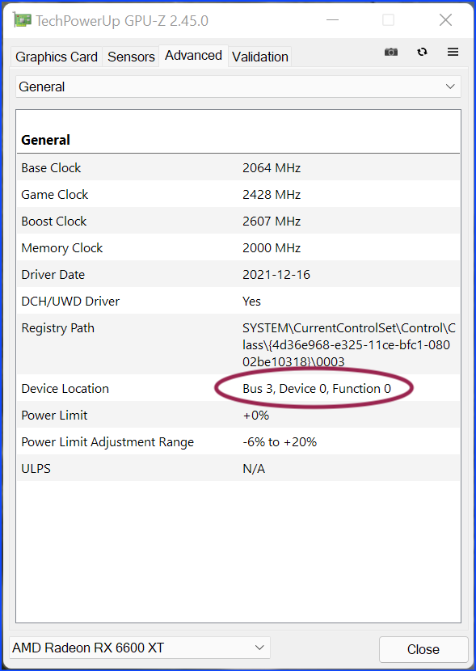
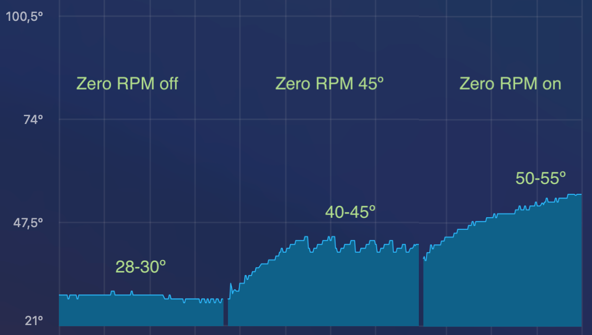

# AMD 6600 on macOS: custom Zero RPM with softPowerPlayTable on SSDT or config.plist

AMD PowerPlay technology allows graphics card to vary performance based on demand, switching between performance and power saving. It has automatic operating modes based on predefined parameters It also allows user settings.<br>
Windows 10 and 11 can make a copy of these energy profiles in the PP_PhmSoftPowerPlayTable registry key whose value is so called SoftPowerPlayTable (SPPT), long hexadecimal string. It is a way to have a quick reference by the operating system.<br>
This SPPT key can be read and modified by some utilities. Thanks to this, it is possible to modify parameters of the operation of the graphics card, changing their behavior and/or energy management and port these settings to macOS.
 
### Zero RPM
 
AMD Radeon 5000 and 6000 series cards come from factory with Zero RPM function activated so that fans are stopped below a temperature (generally 60º), this makes them completely silent except when the graphics processor is demanded (tests , games, etc.).<br>
On my PC, for example, the base temperature in Windows is 35-40º and in macOS it is 50-55º. Although these are safe temperatures for daily use, some users would prefer to have values similar to those of Windows.
The quickest and most effective way to achieve this is by disabling Zero RPM so that fans are spinning all the time and not just above a predefined temperature. However, this is very easy to do on Windows with the Radeon software but on macOS this option does not exist.
 
### SoftPowerPlayTable
 
One way to disable Zero RPM on macOS without changing any other parameters is by using the SPPT table created in Windows. To obtain the SPPT table you have to go to Windows, where it is generated as a registry key and exported to a file that we take to macOS where the file is modified and added to an SSDT file or to the OpenCore config.plist file.
 
## PHASE 1 ON WINDOWS
 
We need 2 apps:

* GPU-Z (from TechPowerUp): Loads the firmware (vBIOS) of the graphics card and exports it to a ROM file that can be read by MorePowerTool.
* MorePowerTool (MPT) (from Igor'sLAB): Reads the ROM file with the firmware and manages the PP_PhmSoftPowerPlayTable registry key (delete existing or create new).

GPU-Z loads the GPU specifications and allows you to export everything to a file with ROM extension. To export (from the Graphics Card tab) use the arrow icon that comes out of a rectangle below the AMD Radeon logo, to the right of the text box with the BIOS version. In the Advanced tab you have to write down the Bus number in the DeviceLocation key, this number (on my system it is 3) is important later, when looking for the sPPT key in the Windows registry.
 



MPT is where the task of generating the SPPT key in the registry with Zero RPM disabled is performed.
At the top, choose the GPU model you have installed; it usually shows the bus number that we noted previously at the beginning of the name (3 in this case).
It is advisable to delete the table that may already exist in the registry from the Delete SPPT button.
Load the ROM file generated with GPU-Z (Load button).
Modify the Zero RPM option by unchecking the checkbox in 2 places: Features and Fan tabs.


There are 2 ways to export the configuration, both ways end up in a text file with the SPPT table:
 
**Method 1**: A more complex method is to write the new SPPT table in the registry from the Write SPPT button, this key is located in
HKEY_LOCAL_MACHINE\SYSTEM\CurrentControlSet\Control\Class\{4d36e968-e325-11ce-bfc1-08002be10318}\
There are some numbered keys here, choose the one that matches the bus number you have written down before: 0003\PP_PhmSoftPowerPlayTable in my case.
With key 0003 selected, export it as registry file (REG) or text file (TXT). File structure is different in each case. Both are valid.
Regedit exports the entire 003 key, not just the PP_PhmSoftPowerPlayTable key.
Save the files somewhere accessible from macOS.

**Method 2**: The simplest method is, from MorePowerTool, click on the Save button >> in the Save file dialog choose Save As REG (registry file) >> a text file with REG extension is generated that contains only the PP_PhmSoftPowerPlayTable key. Save the file somewhere accessible from macOS.
 
## PHASE 2 ON MACOS
 
You must modify the text files to be able to use them in OpenCore >> Convert the text of the Windows files into a formatted hexadecimal string so that it can be included in an SSDT (softPowerPlayTable in SSDT) or in config.plist (softPowerPlayTable in DeviceProperties).
 
#### softPowerPlayTable in SSDT
 
Use GPU-Z in Windows to export your graphics card ROM as discussed above.
 
**SPPT table from ROM**

Extract SPPT table from ROM >> Download *upp* and run it next to the ROM file.

```bash
git clone https://github.com/sibradzic/upp.git && cd upp
python3 setup.py build
sudo python3 setup.py install
sudo python3 -m pip install click
upp --pp-file=extracted.pp_table extract -r <rom_file>.rom
```

After running *upp*, a file called extracted.pp_table is created.
Copy it to the folder where we have the script pp_table-to-hex-dsl.sh

```c++
#!/bin/bash

#█▀ █▄█ █▀▀ █░█ █▀▀ █░█
#▄█ ░█░ █▄▄ █▀█ ██▄ ▀▄▀

#Author: <Anton Sychev> (anton at sychev dot xyz) 
#pp_table-to-hex-dsl.sh (c) 2023 
#Created:  2023-11-22 23:29:47 
#Desc: Convert pp_table to hex dsl format, just simply run and copy / paste
#Sample:
#   With custom path:
#   ./pp_table-to-hex-dsl.sh <file>
#   ./pp_table-to-hex-dsl.sh extracted.pp_table
#   Without custom path put extracted.pp_table file in same folder and run:
#   ./pp_table-to-hex-dsl.sh

thefile="${1:-./extracted.pp_table}"

if [ ! -f "$thefile" ]; then
    echo "Error: File '$thefile' not found."
    exit 1
fi

if [[ ! -e "$thefile" ]]; then
    echo "The $thefile file no exist\nPut your PPT Table file in same folder and run this script again."
    exit 1
fi

file_size=$(stat -f %z "$thefile")

printf "\"PP_PhmSoftPowerPlayTable\",\n\tBuffer ()\n\t{\n" "$file_size"

while IFS= read -r line; do
    if [[ $line =~ ^0000([0-9A-Za-z]+):\ (([0-9A-Z]{2}\ )+)(\ +)(.*) ]]; then
        o=${BASH_REMATCH[1]}
        b=${BASH_REMATCH[2]}
        s=${BASH_REMATCH[4]}
        c=${BASH_REMATCH[5]}
        
        if [[ ${#b} -lt 34 ]]; then
            b=$(echo "$b" | sed 's/.. /0x&, /g')
            b=${b%??}
        else
            b=$(echo "$b" | sed 's/.. /0x&, /g')
        fi

        s=$(echo "$s" | sed 's/   /      /g')
        
        printf "\t\t\t/* %s */  %s// %s\n" "$(echo "$o" | tr 'a-f' 'A-F')" "$b" "$c"
    fi
done < <(xxd -u -g 1 < "$thefile")

printf "\t}\n"
```

Give it permissions to execute: `chmod +x ./pp_table-to-hex-dsl.sh`
Run it: `./pp_table-to-hex-dsl.sh`
By default it looks for the extracted.pp_table file generated by *upp* and transforms it into hexadecimal string to take to the SSDT.

Converted text is displayed in the Terminal window.

```
"PP_PhmSoftPowerPlayTable"
    Buffer()
    {
        /* 0000 */ 0xA6, 0x09, 0x0F, 0x00, 0x02, 0x22, 0x03, 0xAF, 0x09, 0x00, 0x00, 0x77, 0x40, 0x00, 0x00, 0x80,
        ...
        /* 09A0 */ 0x00 , 0x00 , 0x00 , 0x00 , 0x1E , 0x06 // ......
    }

```

Copy the content of the Terminal window to save it to a text file or paste it directly to the SSDT.
 
Note: Keep in mind that with this method we have the factory default table. It has not been changed in regards to the Zero RPM feature.
 
**2.- SPPT table from Windows registry**
 
This method allows you to bring a modified SPPT table to macOS to disable or alter the Zero RPM feature, customizing the behavior of the graphics card.
In the Windows phase we have saved the SPPT table as PP_PhmSoftPowerPlayTable key in Windows registry and we have taken it to 3 different files:

* MorePoweTool >> Save >> Save As REG: contains only the PP_PhmSoftPowerPlayTable key
* MorePowerTool >> Write SPPT >> open Registry Editor >> look for the key in the registry according to the instructions above >> export the entire graphics card section, including but not only PP_PhmSoftPowerPlayTable:
	* Export as REG: Registry 5 file format
	* Export as TXT: hierarchical text format.

Either of the 3 files must be transformed into a valid hexadecimal string for SSDT. This transformation can be automated using the script win-reg-to-hex-dsl.sh or manually step by step.
 
**Automated method**
 
Copy the files generated in Windows to the folder where you have the scripts `win-reg-to-hex-dsl.sh `(for the REG file) and `win-reg-txt-to-hex-dsl.sh` (for the TXT file).

Give them permissions to execute: `chmod +x ./win-reg-to-hex-dsl.sh / chmod +x win-reg-txt-to-hex-dsl.sh`

Run them: `./win-reg-to-hex-dsl.sh Registry-file.reg / win-reg-txt-to-hex-dsl.sh Registry-txt-file.txt`

Converted text is displayed in the Terminal window.

```
"PP_PhmSoftPowerPlayTable",
Buffer()
{
      0xa6,0x09,0x12,0x00,0x02,0x22,0x03,0xae,0x09,0x00,0x00,0x22,0x43,0x00,0x00,0x83,
      ...
      0x00,0x00,0x00,0x00,0x1e,0x06
}
```

Copy the content of the Terminal window to save it to a text file or paste it directly to the SSDT.
 
**Manual method (only REG registry file)**
 
Open the Windows file with a plain text editor that supports Grep-based replacements (I use BBEdit but there are others that also work) and apply these changes one after another:

* Delete all registry keys except PP_PhmSoftPowerPlayTable
* Delete the initial string "PP_PhmSoftPowerPlayTable"=hex:
* Remove spaces from the beginning of all lines
* Remove backslashes (\) from line endings
* Replace the commas with ' , 0x' without the quotes
* Add 0x to the beginning of the text
* Remove all line breaks (you have to use Grep in Find and Replace) -> string on a single line
* Add this to the beginning of the text:<br>
*"PP_PhmSoftPowerPlayTable",<br>
Buffer()<br>
{*
* Add this to the end of the text:<br>
*}*
 
**3.- Include the hexadecimal string in the SSDT file**
 
This is the code of a fairly common SSDT used with AMD graphics cards. You can use it as reference.

```c++
DefinitionBlock("", "SSDT", 2, "DRTNIA", "AMDGPU", 0x00001000)
{
     External (_SB_.PCI0, DeviceObj)
     External (_SB_.PCI0.PEG0.PEGP, DeviceObj)
 
     Scope (\_SB.PCI0.PEG0.PEGP)
     {
         If (_OSI ("Darwin"))
         {
             Method (_DSM, 4, NotSerialized) // _DSM: Device-Specific Method
             {
                 Local0 = Package (0x02)
                 {
// Insert your code here
 
// End mark
 
}
                 DTGP (Arg0, Arg1, Arg2, Arg3, RefOf (Local0))
                 Return (Local0)
             }
         }
     }
 
     Scope (\_SB.PCI0)
     {
         Method (DTGP, 5, NotSerialized)
         {
             If ((Arg0 == ToUUID ("a0b5b7c6-1318-441c-b0c9-fe695eaf949b") /* Unknown UUID */))
             {
                 If ((Arg1 == One))
                 {
                     If ((Arg2 == Zero))
                     {
                         Arg4 = Buffer(One)
                             {
                                  0x03 // .
                             }
                         Return (One)
                     }
 
                     If ((Arg2 == One))
                     {
                         Return (One)
                     }
                 }
             }
 
             Arg4 = Buffer(One)
                 {
                      0x00 // .
                 }
             Return (Zero)
         }
     }
}
```

The text copied earlier from the Terminal window is pasted into the SSDT, right between the comments:

```c++
// Insert your code here
 
// End mark
```

Remember to modify the IOReg path of your graphics card based on your system, it may be different.<br>
To know the IOReg path to the graphics card, it can be done with gfxutil tool or from Hackintool in the PCIe tab >> Name of your device (e.g. Navi 23 [Radeon RX 6600/6600 XT/6600M] >> Device Path column >> copy IOReg path. In my case is:<br>
`PCI0.PEG0.PEGP.BRG0.GFX0`
 
For better identification of the SSDT, rename it to `SSDT-sPPT.aml` and don't forget to compile it to AML format. When you compile the DSL file to AML, the compiler adjusts the format, calculates the buffer size and adds other elements to the string.<br>
Place `SSDT-sPPT.aml` in the APCI folder and in config.plist, restart and reload OpenCore.
 
**4.- Check that the SSDT loads correctly**
 
To see if everything is correct, start IORegistryExplorer and compare what you see with this image (PP_PhmSoftPowerPlayTable is one of the properties of GFX0 or whatever the graphics device is called on your system):
 
 
 
If you have added SPPT string with modified Zero RPM, you must see the changes in GPU temperatures and fans spin. In the image there is 3 conditions, graphics made when there is not high demand:

* Zero RPM off: Zero RPM disabled, temps don't go upper 35º
* Zero RPM 45º: fans start at 45º and stop at 40º
* Zero RPM on: default setting, fans stop below 60º, temps around 50-55º.
 
 

#### softPowerPlayTable in DeviceProperties
 
It is another way to bring the SPPT table to macOS as hexadecimal string into DeviceProperties section of config.plist, with the PCI path that corresponds to your graphics card. My personal experience is that the SSDT method always works, both in Monterey, Ventura and Sonoma, however this other method does not always transmit Zero RPM modifications to macOS.
 
**1.- Preparation of the text**
 
We start from the text file with the keys extracted from the Windows registry.

* Select the block that begins with `“PP_PhmSoftPowerPlayTable”=` deleting the rest of the text.
* Also delete `«PP_PhmSoftPowerPlayTable»=hex:` leaving only the hexadecimal string made up of several lines.
* Search and replace:
	* remove the commas
	* remove spaces at the beginning of the lines
	* remove backslashes (\) at the end of the lines
	* remove line breaks to get a single line string, use Grep in Find and Replace.

Text before the transformation looks like this (the entire string is not shown, just a part):

```
"PP_PhmSoftPowerPlayTable"=hex:a6,09,12,00,02,22,03,ae,09,00,00,22,43,00,00,83,\
00,18,00,00,00,1c,00,00,00,00,00,00,76,00,00,00,00,00,00,00,00,00,00,00,00, \
...
```

After the changes it looks like this:

```
a6091200022203ae0900002243000008300180000001c0000000000007600000000000000000000000001000000010000000d000000520b0000000500 ...
```

**2.- OpenCore**
 
You must know the PCI path to the graphics card, it can be done with gfxutil tool or from Hackintool in the PCIe tab >> Name of your device (e.g. Navi 23 [Radeon RX 6600/6600 XT/6600M] >> Device Path column >> copy PCI path. In my case is this:<br>
`PciRoot(0x0)/Pci(0x1.0x0)/Pci(0x0.0x0)/Pci(0x0.0x0)/Pci(0x0.0x0)`
 
Open the config.plist file in DeviceProperties >> Add > PciRoot(0x0)/Pci(0x1,0x0)/Pci(0x0,0x0)/Pci(0x0,0x0)/Pci(0x0,0x0) and adds the key PP_PhmSoftPowerPlayTable, its value as Data is the long text string.
 


```xml
<key>PciRoot(0x0)/Pci(0x1,0x0)/Pci(0x0,0x0)/Pci(0x0,0x0)/Pci(0x0,0x0)</key>
<dict>
         <key>PP_PhmSoftPowerPlayTable</key>
         <data>>Long string, seen as hexadecimal in PLIST file editors and as Base64 in plain text editors</data>
</dict>
```

Reboot. If everything went well, you will see that fans are spinning all the time with a very low sound, base temperature rarely exceeds 35º and test scores have not changed.
 
Note: slight errors in the hexadecimal string can lead to a black screen when reaching the Desktop, it is highly recommended to have an EFI that works and can boot macOS on a USB device or another disk in case of problems.
 
### April 2023 Note: macOS Ventura 13.4
 
There are users with macOS Ventura 13.4 who are unable to disable Zero RPM when using the SPPT string. Even with it properly loaded from SSDT or from the OpenCore config.plist file (verifiable using IORegistryExplorer), GPU fans are stopped most of the time and temperature ranges between 50 and 55º (approximately 10º more than in Windows), the same as without SPPT string. This happens most frequently with the SPPT table in config.plist, if the SPPT table is in SSDT it usually works fine.<br>
There is a way to recover the lost feature. When modifying the vBIOS ROM file in Windows with MorePowerTool, instead of deactivating Zero RPM (unchecking option box), it is left checked but the temperatures at which the fans start and stop are modified. By default they are configured like this: Stop Temperature 50º and Start Temperature 60º.<br>
I have tried an RX 6600 XT with these settings: Start Temperature to 45º and Stop temperature to 40º. I have written the new registry key and exported it to macOS. With this modification, fans spin and stop with the GPU temperature oscillating between 40 and 45º. GeekBench performance is as expected.
 
### Thanks

* [Igor'sLAB](https://www.igorslab.de/en/) where I have obtained a lot of information
* Anton Sychev ([klich3](https://github.com/klich3)), which added the SSDT method to my original text and created the scripts that allow to do it in an automated way.
