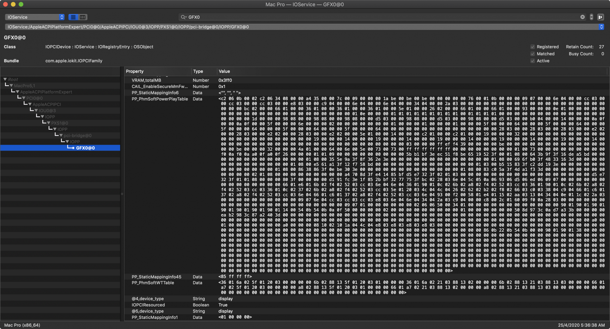

# SSDT METHOD: softPowerPlayTable inside SSDT file

Use GPU-Z to export roms from your graphics card or go to [techpowerup](https://www.techpowerup.com/gpu-specs/) to find one.

Once the ROM file is obtained, we will extract the PPT key as `extracted.pp_table` file. It is the factory default file. Please note that it will not be modified with respect to the ***Zero RPM*** feature!

----

## macOS Extracting PPT from ROM
In macOS we install the following packages:
Download this tool [upp](https://github.com/sibradzic/upp) and run it next to the ROM file.

```shell
git clone https://github.com/sibradzic/upp.git && cd upp
python3 setup.py build
sudo python3 setup.py install
sudo python3 -m pip install click
upp --pp-file=extracted.pp_table extract -r <rom_file>.rom
```

After extracting data, the `extracted.pp_table` file will be created and we copy it to the folder where we have the `pp_table-to-hex-dsl.sh` script.\
Give it permissions to run: `chmod +x ./pp_table-to-hex-dsl.sh`.\
Launch the script `./pp_table-to-hex-dsl.sh`.

***Result:***
```text
	"PP_PhmSoftPowerPlayTable"
	Buffer ()
	{
		/* 0000 */  0xA6 , 0x09 , 0x0F , 0x00 , 0x02 , 0x22 , 0x03 , 0xAF , 0x09 , 0x00 , 0x00 , 0x77 , 0x40 , 0x00 , 0x00 , 0x80 , // .....".....w@...
		/* 0010 */  0x00 , 0x18 , 0x00 , 0x00 , 0x00 , 0x1C , 0x00 , 0x00 , 0x00 , 0x00 , 0x00 , 0x00 , 0x76 , 0x00 , 0x00 , 0x00 , // ............v...

		...

		/* 09A0 */  0x00 , 0x00 , 0x00 , 0x00 , 0x1E , 0x06 // ......
	}
```

In the `SSDT/samples`folder you can find `SAMPLE-NAVI21.dsl`, it is a quite common file, you can use it as a reference.
We copy the result from terminal window and insert it right between the comments:

```
// Insert here your code

// End mark
```

Also remember to modify your PCI device path according to your system.

In the `SSDT/samples`folder there is also an original iMacPro1,1 dump `Original-iMacPro11.dsl`, of course each user has to modify it according to his hardware.\
Maybe everything is correctly detected and we just want to add the PPT string to the system. In this case we can delete all the unnecessary properties.

---

### Cleanup

For better and quicker identification, rename the final file to `SSDT-BR0.dsl` and don't forget to compile to AML format that later has to be put in ACPI folder and in your `config.plist` file.

---

Place it in the APCI folder and reload OpenCore. To check that everything is correct it should look like this image:



---

#### Tools

***Online Converter:*** https://www.rapidtables.com/convert/number/decimal-to-hex.html

In addition to the PPT table extracted with `upp` from the GPU ROM, there are 2 other sources of the data to be converted to DSL-friendly hexadecimal string:

1. Windows Registry key exported as REG file: `script/win-reg-to-hex-dsl.sh`
```
win-reg-to-hex-dsl.sh ../samples/ppt.reg
```

2. Windows Registry key exported as TXT file: `script/win-reg-dump-txt-to-hex-dsl.sh`
```
win-reg-txt-to-hex-dsl.sh ../samples/ppt-reg.txt
```

Both methods allow you to modify PPT with MorePower Tools in Windows to adjust the settings of Zero RPM and load the key with our settings into the SSDT file.

#### Docs:

   * [AMD tweaks: SSDTs vs. DeviceProperties](https://github.com/5T33Z0/OC-Little-Translated/tree/main/11_Graphics/GPU/AMD_Radeon_Tweaks#method-2-selecting-specific-amd-framebuffers-via-deviceproperties)
   * [Creating Custom PowerPlay Tables for AMD Polaris Cards](https://github.com/5T33Z0/OC-Little-Translated/blob/main/11_Graphics/GPU/AMD_Radeon_Tweaks/Polaris_PowerPlay_Tables.md)
